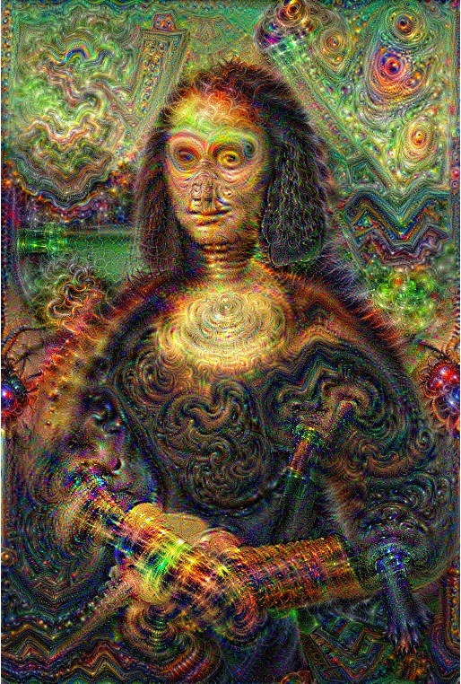

## Deep Dream 

   &nbsp;&nbsp;&nbsp;&nbsp;&nbsp;&nbsp;
  

My implementation (in PyTorch) of Deep Dream.  
Reference: https://research.google/blog/deepdream-a-code-example-for-visualizing-neural-networks/.
